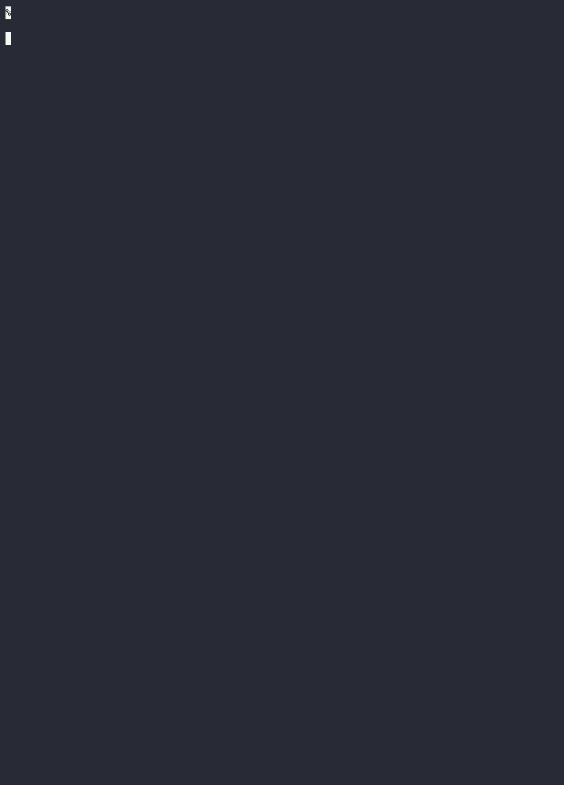

## Data Science Scripts

This is a collection of random data-science exercises either gathered from different articles
or videos that I have used for learning.

___Mileage may vary___
<br />


### Usage

I setup an ___arguably___ complicated Makefile structure since I have so many projects in here.

Here is a demonstration of how it works for the related `building_ml_powered_apps` project:


### Projects and Explanations

Here are some of the included projects:
- [building_ml_powered_apps/](https://github.com/ottingbob/data-science-examples/tree/main/building_ml_powered_apps)
	> This project is built from the Building Machine Leaning Powered Applications Going From Idea to Product Python book. Here is the related [github repo](https://github.com/hundredblocks/ml-powered-applications)
- [derivatives-with-python/](https://github.com/ottingbob/data-science-examples/tree/main/derivatives-with-python)
	> The following examples come from the Derivatives Analytics With Python book. Here is the related [github repo](https://github.com/yhilpisch/dawp/blob/master/python36)
- [financial-analyst-course-2023/](https://github.com/ottingbob/data-science-examples/tree/main/financial-analyst-course-2023)
	> The following directory has examples for learning financial analysis based on [this Udemy course](https://www.udemy.com/course/the-complete-financial-analyst-course)
	>
	> The course is meant to work in excel but I have other plans...
- [hugging_face_course/](https://github.com/ottingbob/data-science-examples/tree/main/hugging_face_course)
	> This project follows the [hugging face course](https://huggingface.co/course/chapter0/1?fw=pt) which provides building and tweaking various types of NLP pipelines. It also exposes a little bit of [gradio](https://gradio.app/) so you can have a way to showcase your models!
- [pycon2020-examples/](https://github.com/ottingbob/data-science-examples/tree/main/pycon2020-examples)
	> This collection of scripts is based off [Keith Galli's](https://github.com/keithgalli) awesome [PyCon2020 NLP youtube video](https://www.youtube.com/watch?v=vyOgWhwUmec). It runs through various NLP techniques and serves as a good introduction with some guidance for starting off your ML journey
- [scripts/](https://github.com/ottingbob/data-science-examples/tree/main/scripts)
	> one off examples usually found from blog posts demonstrating a single topic

### Installations

During the creation of some of the projects / examples I have encountered some issues when working with my recent version of python 11. For instance tensorflow will not be happy with you and as a result it's probably a good reason to start to learn pytorch.

Anyways opinions aside (this is programming right??) here are some notes I have on some libraries having trouble with my setup.

##### umap-learn

In order to try and get `umap-learn` I needed to get a version of llvm working.

In my attempt it looks like the library is still too old to work with python 3.11 =(

```bash
$ poetry add umap-learn

FileNotFoundError: [Errno 2] No such file or directory: 'llvm-config'
RuntimeError: llvm-config failed executing, please point LLVM_CONFIG to the path for llvm-config

$ apt-cache search "llvm-.*-dev" | grep -v ocaml | sort
llvm-11-dev - Modular compiler and toolchain technologies, libraries and headers

$ sudo apt install llvm-11-dev

$ ls /usr/bin/llvm-config*
/usr/bin/llvm-config-11

$ LLVM_CONFIG=/usr/bin/llvm-config-11  poetry add umap-learn
RuntimeError: Building llvmlite requires LLVM 10.0.x or 9.0.x, got '11.1.0'. Be sure to set LLVM_CONFIG to the right executable path.
```

### Resources

Interesting [hacker news article](https://news.ycombinator.com/item?id=34971883) talks about challenges they have with AI in development scenarios. It sounds like it is mostly frustrations due to deployment / infrastructure and rapid prototyping
> We serve our models with FastAPI, containerize them, and then deploy them to our GKE clusters. Depending on the model, we choose different machines - some require GPUs, most are decent on CPU. We take models up or down based on usage, so we have cold starts unless otherwise specified by customers. We expose access to the model via a POST call through our cloud app. We track inputs and outputs, as we expect that people will become interested in fine tuning models based on their past usage.

For the original "davinci" models (now 3 generations behind if you count Instruct, ChatGPT, and upcoming DV"), OpenAI recommends "Aim for at least ~500 examples" as a starting point for fine-tuning
