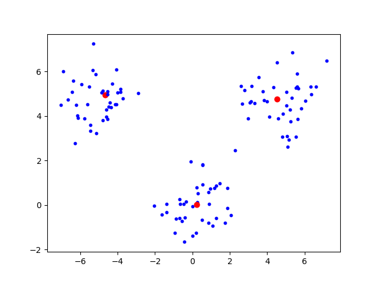
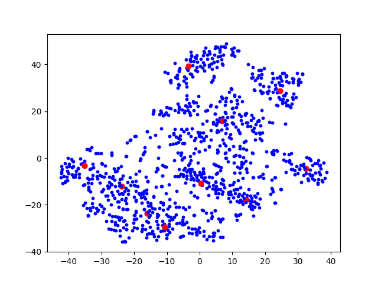
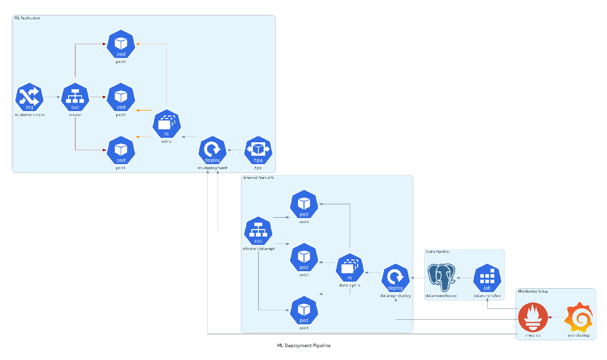
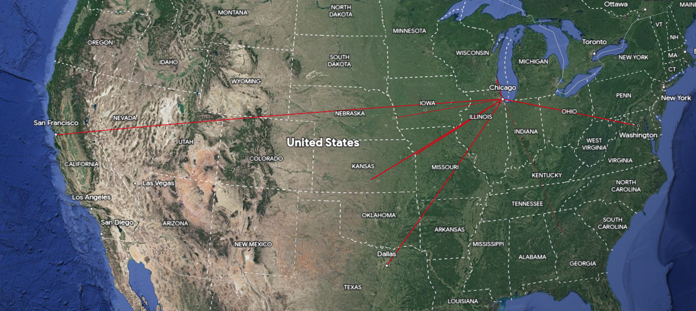

### Scripts

These are some scripts that showcase a single topic from a website / blog post:

- bandit_pam_kmedoids_clustering.py
    > Uses a high peformance implementation of the BanditPam method for clustering data
    >
    > Here is the [github repo](https://github.com/motiwari/BanditPAM) where this library is featured
    >
    > Here is the [paper](https://proceedings.neurips.cc/paper/2020/file/73b817090081cef1bca77232f4532c5d-Paper.pdf) where this methodology is explained 
	
- mnist_kmedoids_clustering.py
    > Uses a high peformance implementation of the BanditPam method for clustering data. This specific example uses MNIST data 
	
- self-attention.py
	> Creates an attention model by just using standard matrix multiplication / operations
- dimensionality-reduction-algos.py
	> Quick and easy example of some dimensionality reduction algorithms included in sklearn
- polars-string-manipulations.py
	>	Example working with string columns in polars dataframes
- ml-deployment-diagram.py
	>	Example working with [diagrams](https://github.com/mingrammer/diagrams) package and creating the following ML Deployment Diagram:
	
- visual-network-tracking.py
	> Example working with Geo2IP data. This parses a wireshark pcap file to create a KMS (google keyhole markup language) file to visualize geographic data over google earth
	>
	> https://support.google.com/earth/answer/7365595?hl=en&co=GENIE.Platform%3DDesktop
	
